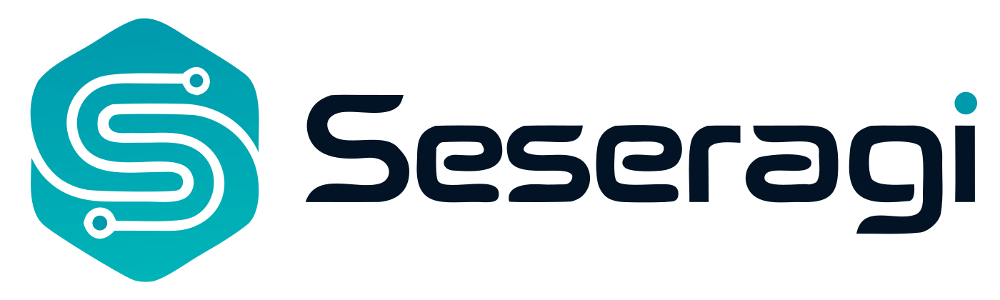

<p align="center">
  <picture>
    <source media="(prefers-color-scheme: dark)" srcset="./assets/brand/extension/logo-dark.svg">
    <source media="(prefers-color-scheme: light)" srcset="./assets/brand/extension/logo-light.svg">
    
  </picture>
</p>

<p align="center"><strong>型・Effect・Signal・DOMを、ひとつの言語として組み立てる。</strong></p>

<p align="center">
  <a href="https://seseragi.vercel.app/">Playground</a>
  · <a href="https://seseragi.vercel.app/tour/">Tour</a>
  · <a href="./docs/README.md">Language specification</a>
  · <a href="./extensions/seseragi/README.md">VS Code</a>
</p>

> [!IMPORTANT]
> Seseragiは現在 **experimental / pre-release** です。Rust compiler、CLI、LSP、WASM
> Playground、Signal / DOM runtimeを同じdriverから育てている段階で、production利用を
> 前提とした互換性はまだ保証していません。

# Seseragi

Seseragiは、独自の型とEffect semanticsを持つプログラミング言語です。
TypeScript / JavaScriptは実行targetの一つであり、言語の意味と構文は
[Seseragi言語仕様](./docs/README.md)を正本とします。

現行compilerはRust実装です。parser、型検査、lowering、CLI、LSP、WASM Playgroundが
同じdriver境界を共有するため、editorで見える型と実行時にcompileされるprogramを
別実装へ分岐させません。

## まず試す

- **[Playground](https://seseragi.vercel.app/)** — browser上で編集・型検査・実行・HTML Preview
- **[A Tour of Seseragi](https://seseragi.vercel.app/tour/)** — Hello worldからEffect、Signal、Web UIまで順に試す
- **[Runnable samples](./examples/samples/README.md)** — 現行compilerで実行されるsample catalog
- **[VS Code extension](./extensions/seseragi/README.md)** — syntax highlight、hover、completion、diagnostic、formatter

## 言語の形

次の例は、現行compilerとPlaygroundのsample checkで実行される
[`examples/samples/data-and-patterns/main.ssrg`](./examples/samples/data-and-patterns/main.ssrg)
をそのまま掲載しています。

<!-- canonical-example: path=examples/samples/data-and-patterns/main.ssrg -->
```seseragi
type Delivery =
  | Preparing
  | Shipped String

fn message delivery: Delivery -> String =
  match delivery {
    Preparing -> "Preparing your order"
    Shipped city -> `Shipped to ${city}`
  }

// constructorをすべて扱うので、このmatchは網羅的です。
pub effect fn main =
  Shipped "Osaka"
  |> message
  |> println
```
<!-- /canonical-example -->

```text
Shipped to Osaka
```

この短いprogramだけでも、取り得る状態を`type`で閉じ、`match`で漏れなく扱い、
pureな変換を`|>`でつなぎ、最後の出力だけをEffectとして実行できます。

## Seseragiで扱うsurface

| Surface | 現在書けるもの |
| --- | --- |
| Data / types | ADT、Struct、Record、generic、pattern match、newtype、type alias |
| Composition | function、pipeline、custom operator、Functor / Applicative / Monad instance |
| Effects | `effect fn`、`do`、typed failure、Console / Stdin、resource境界の一部 |
| Reactive UI | `Signal`、pure HTML、function component、browser DOM event、form、IME composition |
| Tooling | Rust CLI、formatter、native LSP、VS Code extension、WASM Playground |

実装済み範囲と未接続領域は[STATUS](./docs/STATUS.md)に明記しています。
仕様に存在することと、現行compilerで動くことは同一ではありません。

## Quick start

必要なtoolchainはRustとBunです。PlaygroundのWASMを再生成する場合だけ`wasm-pack`も使います。

```sh
# compilerをbuild
cargo build -p seseragi-cli

# canonical Hello worldをcompileして実行
cargo run -p seseragi-cli -- run examples/samples/hello-world/main.ssrg

# TypeScript成果物をdist/へ生成して実行
cargo run -p seseragi-cli -- build examples/samples/hello-world/main.ssrg
bun run dist/entry.ts

# formatter
cargo run -p seseragi-cli -- format --check \
  examples/spec/artifacts/schema-1/rock-paper-scissors-cli/main.ssrg
```

`run`と`build`はsingle fileに加えて、`seseragi.json`を持つlocal packageも受け取ります。
生成物の構成、project discovery、release identityは
[implementation documentation](./docs/IMPLEMENTATION.md)と
[release contract](./docs/RELEASE.md)を参照してください。

## Playground

```sh
# local development
bun run dev:playground

# sample、Tour、test、typecheck、bundleを検証
bun run check:playground

# compiler / runtime contract変更時にWASMを再生成
bun run build:playground:wasm
```

PlaygroundのLearn / Discover catalogは`examples/tour/`と`examples/samples/`を正本に生成します。
READMEやUIへだけ動かないsampleを複製しません。

## VS Code

正式extension IDは`seseragi-dev.seseragi`です。GitHub ReleaseからOS / CPUに合うVSIXを取得し、
`Extensions: Install from VSIX...`で導入します。VSIXには対応するnative `seseragi-lsp`が
一つだけ同梱されます。

導入方法、formatter設定、旧preview IDからのmigrationは
[Seseragi for VS Code](./extensions/seseragi/README.md)を参照してください。

## Project status

- compiler / runtimeはRust再実装の縦sliceを継続中
- CLI、LSP、formatter、WASM Playgroundは同じcompiler driverへ接続済み
- ADT、match、Effect、Signal、SSR / DOMの実行可能範囲をsampleとconformance fixtureで固定
- TypeScript interop、filesystem / HTTP、Stream、hydration等は未着手または部分実装
- release前のため、構文・型・runtime contractは変更される可能性あり

正確な現在地は[STATUS](./docs/STATUS.md)、実装順は[ROADMAP](./docs/ROADMAP.md)、
仕様の検証範囲は[SPEC COVERAGE](./docs/SPEC_COVERAGE.md)を参照してください。

## Repository guide

| Path | Role |
| --- | --- |
| `crates/` | Rust compiler、driver、CLI、LSP、WASM、conformance |
| `runtime/ts/` | 生成codeが接続するversioned TypeScript runtime |
| `apps/playground/` | CodeMirror / WASM PlaygroundとTour |
| `examples/samples/` | 現行compilerで動くsample catalog |
| `examples/tour/` | Playground Tourのcanonical lesson |
| `examples/spec/` | specification lesson、fixture、execution artifact |
| `docs/spec/` | normative language specification |
| `extensions/seseragi/` | 正式なVS Code extension |

## Development

変更範囲に応じてscoped gateを選びます。

```sh
bun run check:sample
bun run check:playground
bun run check:rust
bun run check:extension
bun run check:release

# 複数領域を横断する統合時のみ
bun run check
```

検証laneの選択基準は[Scoped checks](./docs/SCOPED_CHECKS.md)、compiler / runtimeの責務境界は
[IMPLEMENTATION](./docs/IMPLEMENTATION.md)を参照してください。

## License

Apache-2.0
