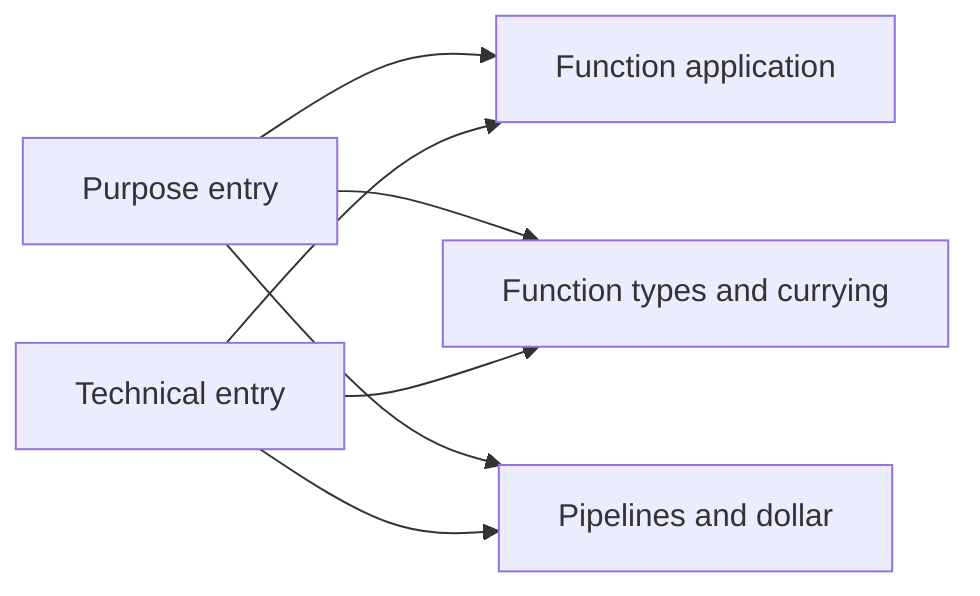

# #766 Home とナビゲーションの実装準備

これは [#766](https://github.com/KentaroMorishita/seseragi/issues/766) の差分計画で、
新しい編集規範ではない。文章・コードの規範は [editorial-contract.md](editorial-contract.md)、
導線は [site-architecture.md](site-architecture.md)、移行は
[migration-ledger.md](migration-ledger.md) に従う。
[61問の記録](https://github.com/KentaroMorishita/seseragi/issues/601#issuecomment-6091076228)
にある明示的な否定と、未確定の解釈を区別する。

調査時点は 2026-10-10。実公開は #769 merge `58fc939d8bb6`、
準備 branch の base は #771 `7a0a0390b6bb`。
#772→#770→#771 の完全 CI は実行中で、統合前に Home の実装を重ねない。
この branch は計画と実行証拠のみを持ち、公開 UI は変更していない。

## 決定と、実装で判断する部分

| 根拠 | 守る決定 | 実装時の扱い |
| --- | --- | --- |
| Q3 / Q12 / Q27 | 経験言語を限定せず、日英で自然な会話の温度と同じ意味を保つ | 最初の説明を TypeScript 経験の前提にしない。逐語的な語尾変更で済ませない |
| Q17 / Q18 | 新しい記法の意味を省略しない | Hero は短い補助説明と詳細へのリンクを置き、型・記法の全講座にしない |
| Q24 / Q30–Q34 | Hero、一例、短い紹介、明確な出口。機能カードや全面 IDE の過積載を拒否 | DOM は言語名・紹介・入口を先に読む順序。余白・比率・仮コピーは実画面で review |
| Q28 | 目的と技術名の二つの入口から同じ記事 identity に辿る | 章の別コピーや別記事 tree を生成しない |
| Q35–Q43 | 小さい意味のある関数と自然な合成。記号は使うがノルマにしない | literal pipeline、長い説明名、送料や単価の例の Hero 自動採用を避ける |
| Q46 / Q47 | さりげない Built with Seseragi、typed 部品と自然な構成 | 既存 Seseragi renderer を使い、内部実装を製品説明の主役にしない |
| Q52 / Q60 / Q61 | 実装状態、実行、表示、編集 review、作者・実読者 feedback を区別 | CI や agent review を人の承認と呼ばず、未確認は pending のまま記録 |

Q30 の A+C の厳密な選択、Q31 の視覚比率、Q37 の題材選択は未確定。
水・自然の装飾や特定の Hero コードを承認済みとして実装しない。
#768 の inline editor や型 hover は、Home 公開の前提にしない。

## 現行実装から分かった差分

| Surface / source | 現況 | 次の差分 |
| --- | --- | --- |
| `pages/home/{page,en,ja}.ssrg` | 送料の一例と長い逐語説明。lead は TypeScript 比較を前提にする | 短い紹介と独立選定した一例へ。送料の canonical source と Examples は保全 |
| `layouts/home.ssrg` | 全 `page.blocks` を Hero 右列へ描画し、下は Reference の二つの area card | Hero 用 blocks と紹介・入口を明示的に分ける。既存二つの Reference 入口も保持 |
| `pages/docs/overview/` | 関数を宣言する入口が型注釈の記事へ向く | 新章三記事へ目的・技術名から辿れる入口を追加。型注釈の lookup は残す |
| `pages/language/overview/` | values/types/declarations/calls と全 concept directory | 新章の短い見取り図を入口にし、全 concept directory と identity は保持 |
| `components/site-header.ssrg` / `styles/responsive.css` | mobile は global links のうち Docs 以外を CSS で隠す | native disclosure を使う全体メニューから五つの既存 destination を辿れるようにする |
| `i18n/{model,en,ja}.ssrg` / `components/mobile-sidebar.ssrg` | `documentation` を global Reference label と記事 drawer の label に共用 | global Docs と現在の Reference tree の label を分け、drawer の意味を保つ |
| `render/document.ssrg` | canonical/hreflang/description はあるが favicon link がない | head から既存 icon を参照し、repository-owned `favicon.ico` も Docs output へ配信。新しい資産の作成や root domain 設定変更はしない |
| `pages/examples/` | 送料・record・literal 始まりの三通りの計算・Web の実体がある | 空殻として再実装しない。合成の例を新章の自然な計算へ置換し、元 source は最後の consumer 確認まで保持 |
| `pages/releases/` / `pages/docs/first-run/` | v0.61.19 / Bun1.3.9 は 2026-10-01 の明示的な検証 snapshot | 旧証拠を削除せず、現在の公開 release と新しい実行証拠を区別して案内 |
| `client/` / `styles/` | 検索 UI と `prefers-reduced-motion` の処理は確認できない | 実装済みと主張しない。検索の生成境界を調査し、motion 設定の検証を追加 |

公開 Home・関数適用の16 cases、First Run/Examples/Releases の24 casesを確認済み。
英日、390/1280px、JS 有効/無効、HTTP200、lang、h1、locale destination、横 overflow を確認。
全 route・全 browser gate の代替ではない。現行 `/favicon.ico` 404 は残っている。
Cloud の browser trust 制約は、別途 TLS 検証有効の curl と区別して記録している。

## 第一 batch: 玄関と新章への入口

Home、Docs index、Language index、global menu、favicon を一つの可逆な差分にする。
Examples/Releases/First Run の本文や commands を一括で作り直さない。
各 URL は維持し、global Tour/Playground の行き先と役割は変えない。

Home の構造は、言語名と短い lead → First Run/Docs → 一つの complete code と実際の結果 →
短い紹介と purpose/technical entry → Language/Library lookup とする。
desktop の列比率や高さは承認済みの固定値ではなく、mobile も含め実画面で判断する。
機能の大きな card 羅列や初期状態での IDE は置かない。

既存 `PageDefinition` と `Block` の契約は全ページで保つ。
候補は Home 自身が `heroBlocks` / `bodyBlocks` の typed 配列を持ち、
`page.blocks` はそれらを結合する構成。layout はこの二領域を同じ `article` 部品で
各一回描画する。anchor の文字列を探して暗黙に分割する処理や別 renderer は作らない。
canonical code/出力が一度だけ表示され、全 blocks の link/fragment が検証されることを確認する。

### 二つの入口、同じ三記事

| 目的の入口（草案） | 技術名 | 既存 identity / route |
| --- | --- | --- |
| 検索用の文字列を作る / Make a search key | Function application / 関数適用 | `language.syntax.function-application` — `/docs/language/syntax/function-application/` |
| 同じ条件を使い回す / Reuse a search condition | Function types and currying / 関数型とカリー化 | `language.types.function-types` — `/docs/language/types/function-types-and-currying/` |
| 呼び出しを組み合わせる / Put calls together | Pipelines and low-precedence application / パイプラインと低優先順位の適用 | `language.syntax.pipelines` — `/docs/language/syntax/pipelines-and-low-precedence-application/` |



英日で同じ三つの identity を使い、locale prefix だけを変える。
技術名の page-name link は現行 localized title と一致させる。
目的 label と page-name label は別の UI として明示し、既存 title guard を弱めない。
新章の説明や strict rules は複写せず、各記事とその anchor へリンクする。
Tour は順序付きの練習、Playground は編集環境として global destination に保持する。

### Hero の実行済み候補

候補 A は短い fn/main と普通の適用を優先する初期案。
Hero 選定・作者の美学承認・公開済みの意味ではない。

```seseragi
import * as text from "std/text"

fn handle name: String -> String = "@" + text.toLower (text.trim name)

pub effect fn main = println $ handle " Seseragi "
```

実出力は `@seseragi`。display label を整える例で、アカウント名の validation の主張ではない。
説明は、pure function が String を作ること、`$` が呼び出し全体を引数にすること、
`main` が printing effect を返して runner が実行する境界を短く扱い、詳細へ案内する。
元 source の SHA256 は `2d34124cce67f476094e064365341f7236e3f7efc9d7004bc910ab055d87f130`。

候補 B は `find` の Maybe を保ち、`label <$> note` で見つかった label だけを変える。
実出力は `Just ↗ River notes`、検索条件を Sea にすると `Nothing`。
`<$>` には用途があるが、Hero では二 import と Maybe の説明負荷が増える。
Examples に置く選択肢も残す。記号ノルマや大きな題材のためには採用しない。
完全 source・hash・正式 release CLI の format/lint/run は
[候補の機械記録](../../reviews/issue-766/2026-10-10-hero-candidates.json)に保存。
既存現行 WASM でも A/B と missing variant の出力を確認済みだが、選んだ例の
統合時には canonical registry・表示・copy・Playground seed・native/WASM の一致を再確認する。

### 互換 URL / fragment

| 現行 | 扱い |
| --- | --- |
| `/`, `/ja/` | identity と locale/canonical/alternate を維持 |
| `/#shipping-example`, `/ja/#shipping-example` | unrelated Hero に同義 alias しない。旧 fragment を残した短い移動案内から、同じ送料 source/output の `/examples/#shipping-total` と英日 mirror へ進める |
| `/docs/#start-here`, `#first-run`, `#learn-by-doing`, `#find-reference` | 意味を保つ位置に残す。Tour と Reference の参照先を失わない |
| `/docs/language/#values-and-functions`, `#find-concept` | 章の入口と concept lookup として保持。新しい duplicate chapter route は作らない |
| `/examples/#shipping-total`, `#record-update`, `#connect-functions`, `#larger-projects` | 既存用途・source 履歴を保ちながら、小 batch で本文を移行 |
| `/docs/first-run/` と各 OS / run / troubleshooting / next anchor | commands を変えない batch ではそのまま保持。変更したら対象 OS の実行 scope を再記録 |

Home の旧 shipping fragment を browser の JS 有効/無効で開き、移動先で
送料 source、`3700, 5000`、locale が対応することまで確認する。
単に同名 ID が存在することだけで互換合格にしない。

## 後続 batch と未完了事項

**Examples と Releases/First Run の更新。** Examples の合成例は、#771 で検証した
`syntax-reader-pipelines` の named commands / configured predicate / Maybe を使う計算が候補。
既存の送料・record・Web の結果や用途リンクを保ち、本文を TS の経験者専用にしない。
旧 `reader-pipelines` source は、全 consumer を確認する前に registry から削除しない。

GitHub の latest release を 2026-10-10 に再照会すると v0.61.23（2026-10-08、15 assets）。
annotated tag を解決した commit は `46755c08f4e925859a045ed352a72168aa4a32fe`。
workspace version は公開済みの証拠に使わず、`release-contract.ts` の artifact/version 規則と
GitHub Release/tag の確定情報を使う。生成の途中で latest API を毎回問い合わせない。
取得・確認した snapshot を英日で共有し、二回 build の determinism を保つ。
v0.61.19 の日付付き履歴と platform 未実行の表示を残して、新しい現行案内と区別する。

Linux x64 の正式 tarball/checksum を照合し、Bun1.3.11 で canonical hello-world を
fresh directory にコピーして format/lint/run を実行した。stdout は `Hello, Seseragi!`、
CLI は release channel、tag/commit と一致。証拠は
[Linux First Run 記録](../../reviews/issue-766/2026-10-10-linux-release-first-run.json)。
これは unpacked binary からの実行で、bootstrap installer・global install・IDE extension・
macOS/Windows の実行を証明しない。#706 の current-source optimized CLI にも代用しない。

**検索。** 現行 client/header に実装は確認できないため、完了条件から黙って除外しない。
新しいサービスや手書きの API inventory は導入せず、Seseragi-owned catalog と
compiler-owned symbol identity/title から導ける静的 index と必要時の小さい client を検討する。
実装境界・index coverage・memory/profile・CSP を先に確認し、独立した差分にする。
同名 symbol の owner/kind、英日 destination、keyboard、empty/no-result、no-JS の
Language/Library lookup fallback を検証する。検索実装未完了のまま #766 全体を close しない。

生成境界の bounded probe は、#771 `7a0a0390b6bb` の実 source closure と、967 examples /
63 modules / 1,812 symbols を含む current input から `catalog` を呼び、ページごとの
identity・locale・route・title・summary を Seseragi で JSON 化した。
英日各1,988件、計3,976件で route inventory は現行 public manifest と一致。
別々の Bun1.3.11 process の二回出力は byte一致（SHA256
`712a9ba7450434689e4c3159d0d1e790fb87d1502e872e1f91a8743b7a0d6659`）。
全体1,125,198 bytes、gzip130,016 bytes。locale別の gzip は EN61,790 / JA68,301 bytes。
生成8,300 / 3,384ms、process-tree peak RSS1,188,636 / 1,182,364KiB、残存 process は0。
compile と各生成は90秒 / 4GiBに制限した。これは検索 index の調査で、全 site の二回生成、
現在 head の正式CI、browser、公開の合格証拠には使わない。
[完全な入力・source・toolchain・測定記録](../../reviews/issue-766/2026-10-10-search-catalog-probe.json)
に local optimized CLI の古い commit metadata と、その制限を明記した。

各localeに同名titleが111種類あり、`empty` と `get` は各8ページある。
結果の title だけでは識別できないため、compiler-owned module / namespace / item kind / identity
を同じ入力から持たせる。title/summary は解決済み page から読み、`editorialFor` を再評価しない。
共有 `referenceRoute` を使う一回の metadata lookup が候補で、client に API inventory を
コピーしたり、owner を title から推測したりしない。

実装候補は既存の一回の planning process が typed index を返し、transport が locale別の
静的assetとして一回書く構成。全HTMLへ1.13MBを埋め込まず、常駐rendererや新しいcompilerは作らない。
RenderResponse の契約変更、plan validation、追加assetの全hash比較、同名symbolの識別、
実際の planning RSS と全420秒 budget を再測定してから採否を判断する。
必要時の fetch は、現行 `connect-src 'none'` のままでは使えない。
同一originの静的indexだけを読む場合に `connect-src 'self'` を検討し、外部接続を増やさず
browserで成功・失敗時fallbackを確認する。UI は必要時に開き、結果DOMの件数を有限に保つ。
この probe に owner/kind field、ranking、UI、CSP変更、a11y、no-JS fallback は未実装。

**motion/SEO。** 現行に reduced-motion handling は確認できない。
`styles/base.css` の全体の smooth scroll、`styles/docs.css` の二箇所の transition、
`styles/home.css` の path-card hover が対象。追加する transition も含め、
reduced-motion では scroll を auto にし、移動と transition を抑制する。
drawer の現行 `scrollTo({behavior: "instant"})` は維持し、current link の
`scrollIntoView` と fragment 移動を preference 別に実画面で確認する。
canonical/hreflang/x-default/description、document lang、h1、repository-owned icon の実取得を保つ。
既存 `assets/brand/public/brand/favicon.ico` は SHA を保って Docs output の
`/favicon.ico` へ配信する候補。head の icon link と直接取得の両方を確認し、現在の404を
未解決のまま console-clean と呼ばない。これは Docs 配信先内のassetで、#631 の primary
root domain 切替ではない。manifest に追加assetとhashを含め、二回の全artifact比較へ入れる。
全 page の icon/head を触る変更は全 site gate で確認する。

## 受け入れと実行順

| 軸 | 第一 batch の確認 | 後続で必要な確認 |
| --- | --- | --- |
| 編集 | 一つの例、簡潔な紹介、自然な小関数/命名/適用。親の独立 review と作者・実読者 pending を別記 | Examples の再編集、release snapshot の明確さ |
| source / 実行 | 表示・copy・seed の exact source/hash、native/WASM の同じ結果、effect 境界 | 変更した install/update commands の実行 scope、artifact/tag/commit |
| 導線 | 目的/技術名が同じ三記事へ。First Run/Docs/Examples/Releases/Tour/Playground の意味と URL | 全検索 index と同名 symbol の目的地、no-result/fallback |
| 表示 | 英日、320/390/760/960/1160/1280/1710px。code panel の scroll は保持し document overflow を作らない | 検索 popup/results と release downloads の mobile 操作 |
| a11y / no-JS | native global menu、全五 destination、locale deep link、keyboard/open/close/focus。既存 article drawer の modality と scroll を維持 | search keyboard/no-JS fallback。motion preference と disclosure の相互作用 |
| 互換 | 旧 shipping fragment から同じ送料例へ。既存 doc/index/example anchors と英日往復 | retired source の最後の consumer と履歴 |
| full gate / 公開 | canonical Bun1.3.11 / current-source optimized CLI、二回全 route/hash、4GiB/RSS/cleanup、最終 head の全 browser | 各完成 batch の同じ品質 gate と実公開 browser |

実装時は最も狭い scoped checks から始め、変えた title/label/source の assertion を
新しい意味に合わせて更新する。固定 panel count へ戻したり、coverage/timeout を
減らして通したりしない。Home に送料 source があるという旧 assertion は、selected Hero の
exact source/output と、送料の移動先での exact source/output に置き換える。

最終 PR は完全 `check:site` と browser/artifacts を通し、親の独立 review と通常 merge を経る。
Docs production の実際の URL/commit を確認し、英日 Home・Docs・旧 fragment・global menu・
主要 destination・no-JS・mobile/desktop を public browser で確認して GitHub に記録する。
新しい章/全 corpus の作者・実読者 feedback の一括完了を公開停止条件にしない。
root/Playground domain cutover (#631) と非Docs #761/#762 はこの計画の対象外。
