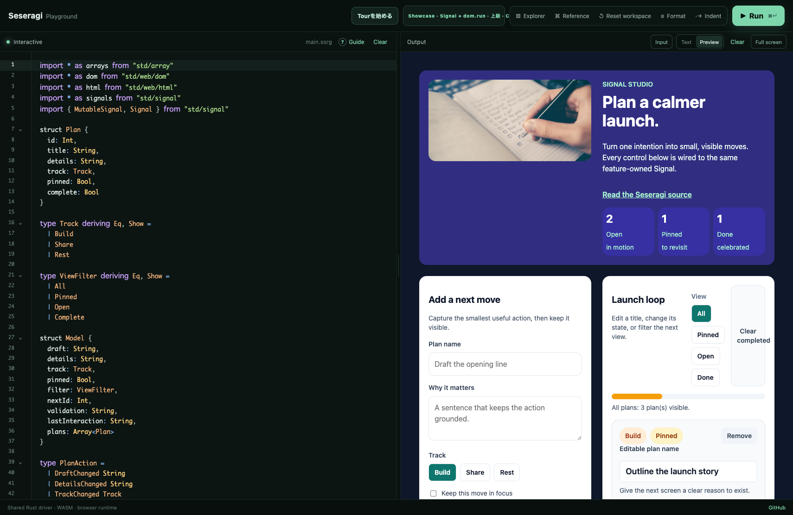
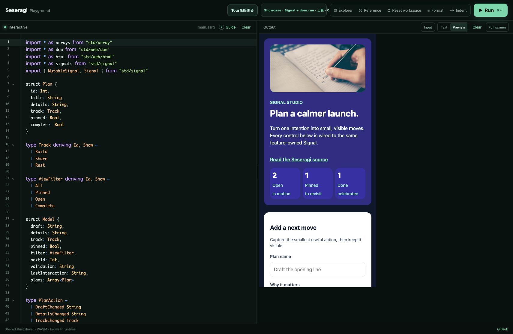
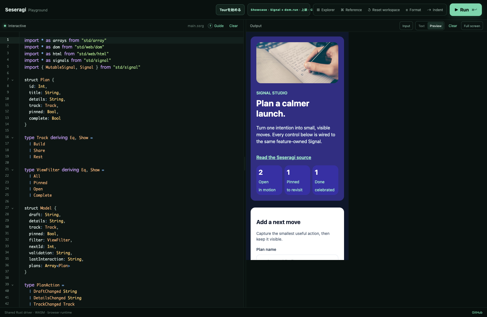

# Issue #188 visual review artifact

`form-todo` の実DOM interaction fixtureとPreviewの確認結果を、同じcommitで追跡するためのartifactです。

## Recorded run

- runner: `browser-use`
- URL: `http://127.0.0.1:5173/`
- Preview iframe: `#html-preview`
- 記録日: 2026-08-02
- Code editorとPreviewを同じ画面に表示し、iframe幅だけをviewport契約値へ変更しました。

操作は [form-todo.interaction.json](../../../apps/playground/tests/fixtures/form-todo.interaction.json) に固定しています。実DOMで次の順序を実行しました。

1. initial populated stateを確認
2. titleだけでsubmitしてvalidation / disabled契約を確認
3. details、Share、pinnedを入力してsubmitしitemを追加
4. inline edit、complete、pin、removeを確認
5. Done filter、ArrowRight循環、End=Doneを確認
6. 説明文のtouch pointerdownを確認
7. Clear completed、全item remove、empty stateを確認

## Viewports

| 契約 | Preview幅 × 高さ | 確認内容 |
| --- | --- | --- |
| desktop | 538 × 966 | Code editor + hero / form / boardの2列Preview |
| iPhone 13 | 390 × 844 | hero、form、cardが1列へ切り替わり、横overflowなし |
| small Android | 360 × 800 | initial / populated / emptyの1列状態 |

画像はPlayground全体のbrowser viewport `1710 × 1112`から取得しています。fixtureの `previewWidth` / `previewHeight` が実際のiframe幅・高さを示します。

## Automated contract

`apps/playground/tests/form-todo-interaction.test.ts` が次を固定します。

- fixtureのsample source / sourceHash / workspaceHashがgenerated manifestと一致すること
- State / Action / update、explicit `signals.make` + `dom.run`、event adapter、empty state、accessibility markerが存在すること
- invalid / valid submit、item追加、inline edit、complete、pin、remove、filter、keyboard、pointer、clear、emptyの全stepがfixtureにあること
- desktop / iPhone / small AndroidのCode editor + Preview artifactが存在すること
