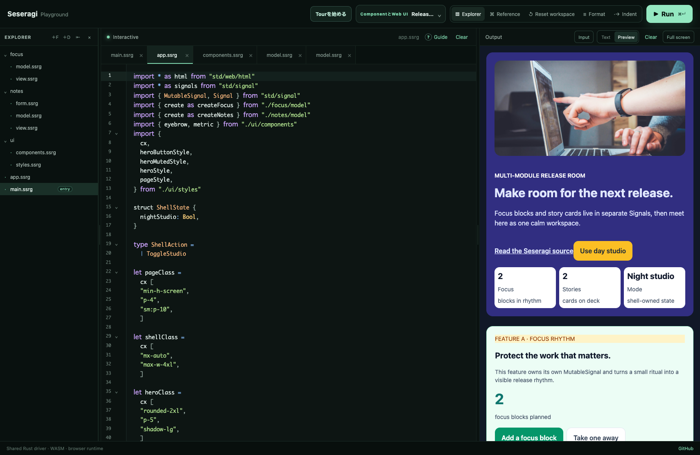
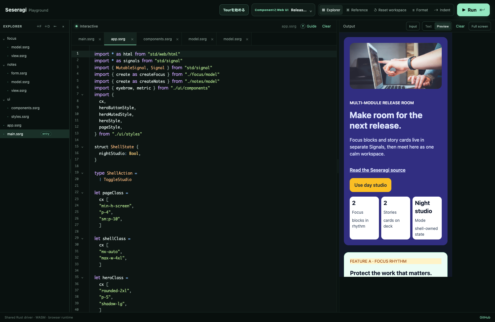
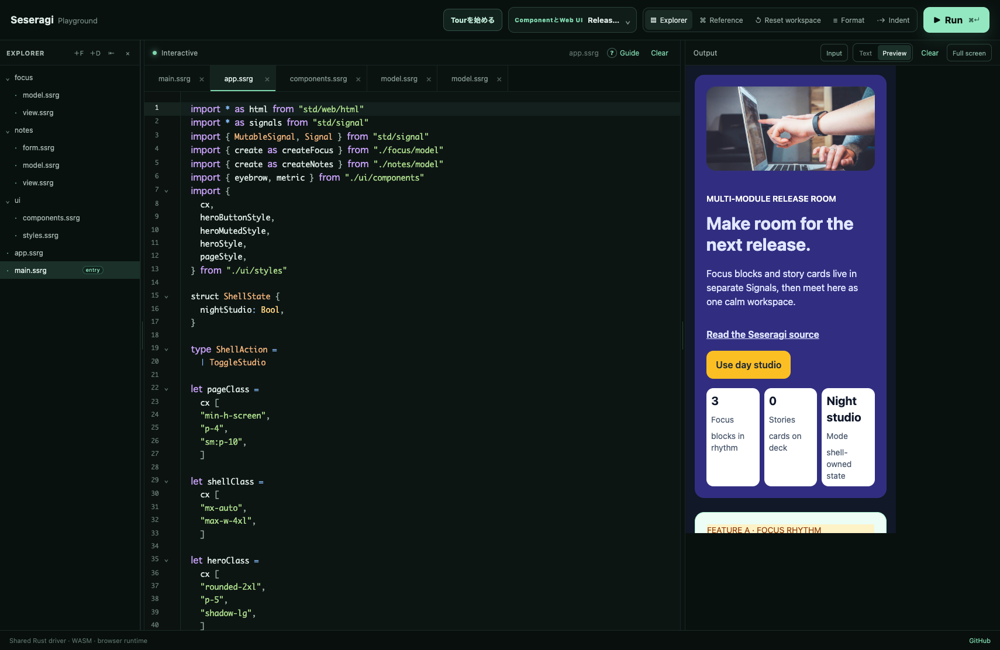

# Issue #189 visual review artifact

`project-flow-app` をRelease Roomへ刷新したinteraction fixtureと、Explorerを含む
Playground Previewのreview artifactです。

## Recorded run

- runner: `browser-use`
- URL: `http://127.0.0.1:5173/`
- Preview iframe: `#html-preview`
- 記録日: 2026-08-02
- Explorerを開き、`app.ssrg`をactiveにしたCodeとPreviewを同じ画面で確認しました。

操作は
[project-flow-app.interaction.json](../../../apps/playground/tests/fixtures/project-flow-app.interaction.json)
に固定しています。Focus rhythmのblock追加、Story deckのinvalid / valid submit、
summary更新、inline edit、remove、empty state、studio切替、Preview cleanupを順に確認しました。

## Viewports

| 契約 | Preview幅 × 高さ | 確認内容 |
| --- | --- | --- |
| desktop | 538 × 966 | Explorer + app.ssrg Code + Preview、heroと二つのfeature surface |
| iPhone 13 | 390 × 844 | CodeとPreviewを保ったまま、heroとfeatureが一列へ切り替わる |
| small Android | 360 × 800 | initial / populated / emptyで横overflowなし |

cleanup時はClearがPreview iframeのactive resource countを`1 → 0`にすることを
fixtureに記録しています。

## Automated contract

`apps/playground/tests/project-flow-app-interaction.test.ts` は次を固定します。

- generated manifestのsource / workspace hashとmodule tree、Explorer初期状態が一致すること
- mainの`dom.query` / options / `dom.run`、appのSignal composition、feature-owned
  state / Action、shared `cx` / component / empty stateが存在すること
- initial、Focus、invalid / valid form、summary、add / edit / remove、empty、studio、cleanupの全stateがfixtureにあること
- desktop、iPhone、small Androidのreview PNGが存在すること
