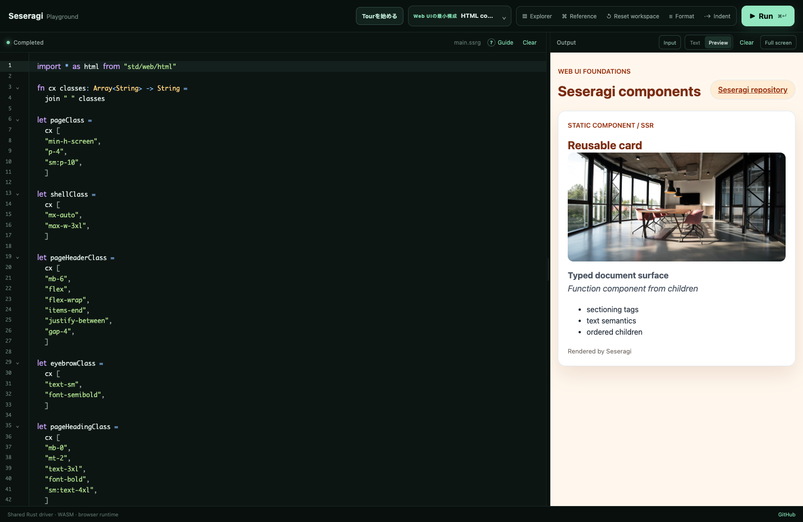
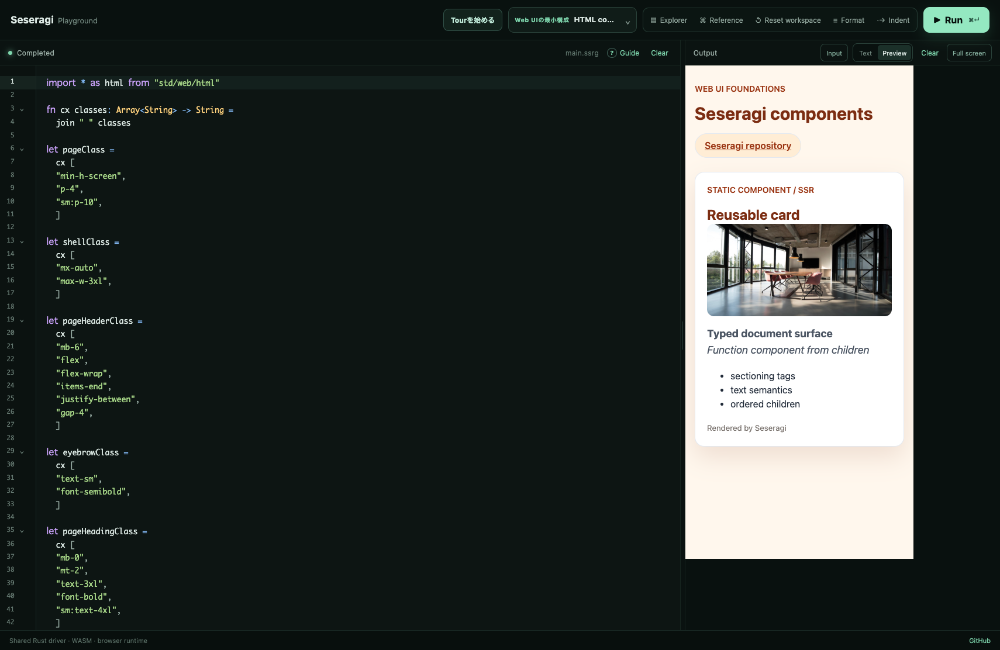
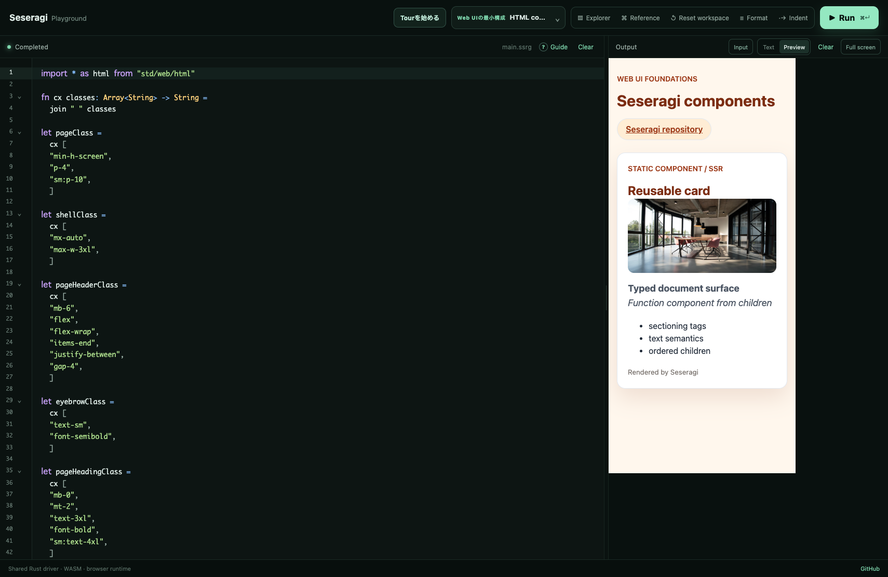
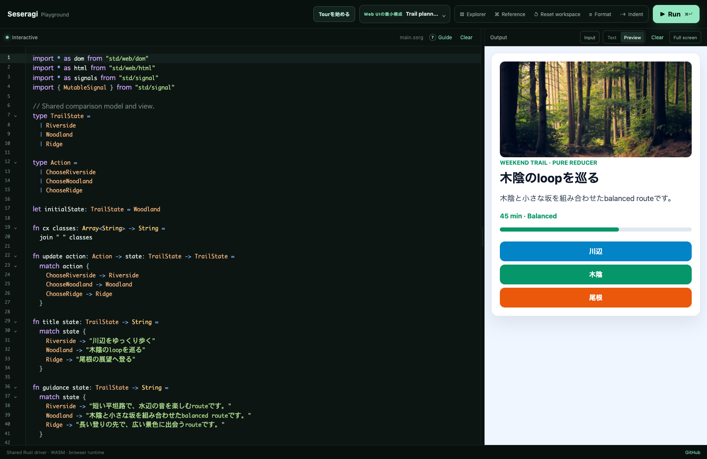
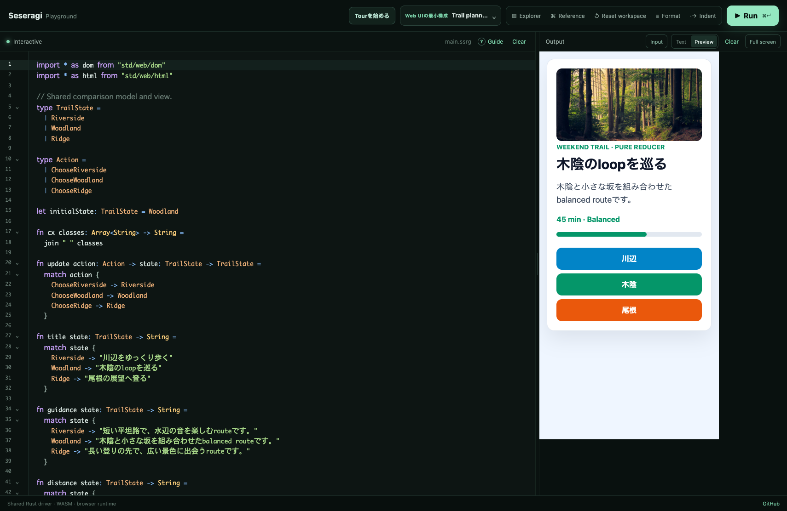
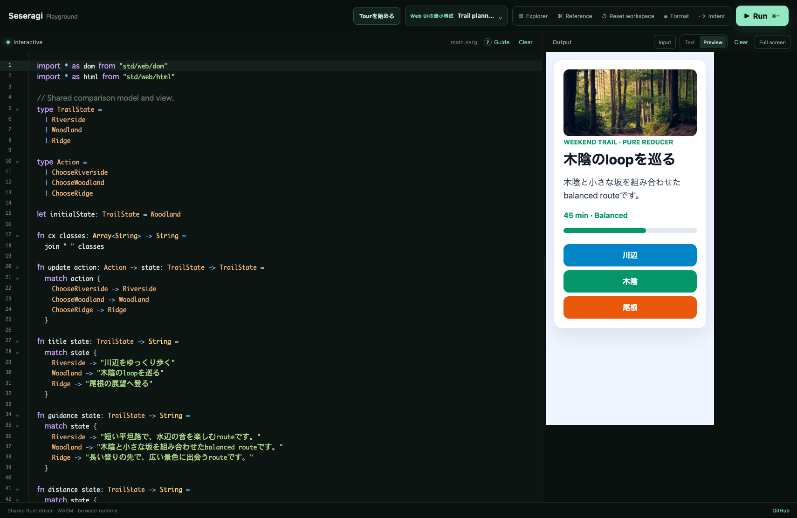
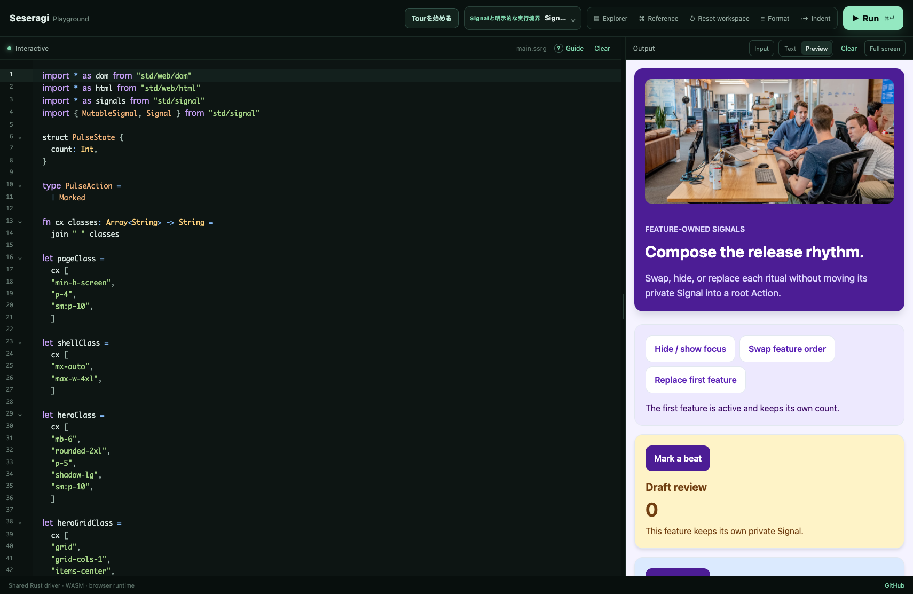
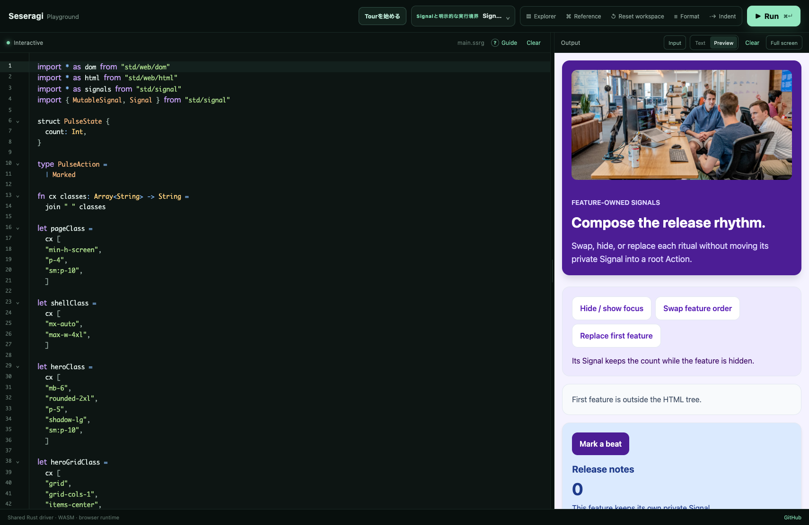
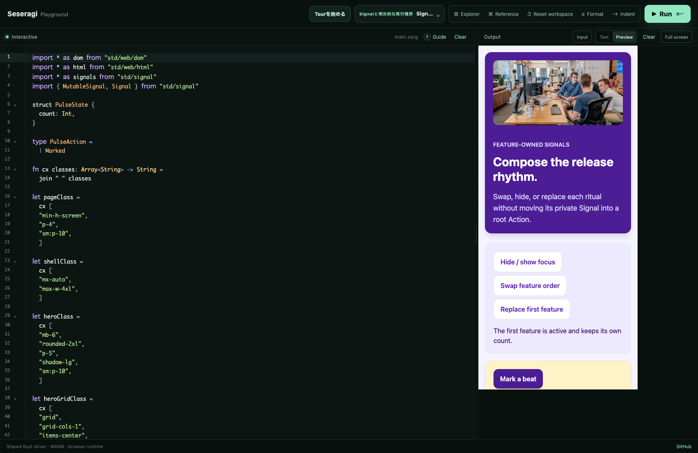
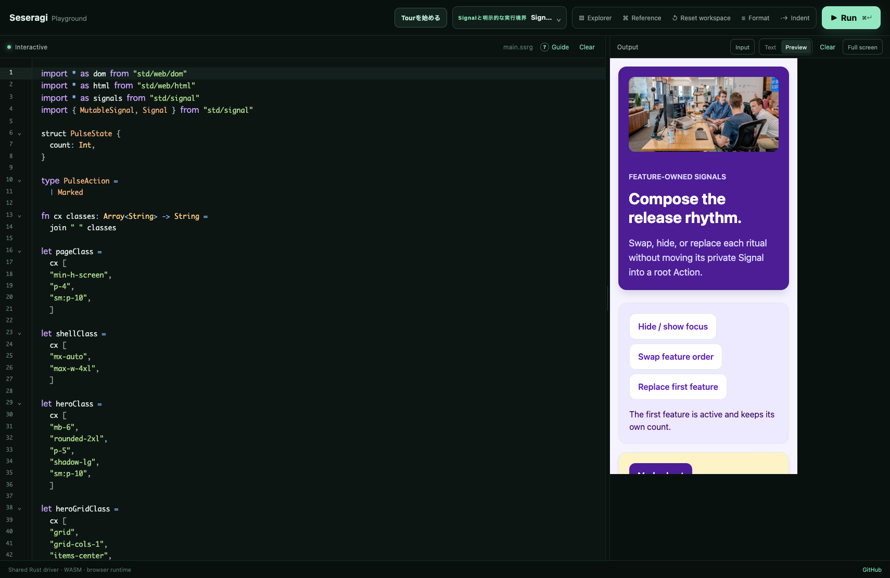

# Issue #190 canonical Web UI visual review

全`outputMode: html` sampleを、Previewの目的・fixed Unsplash image・responsive
layout・state artifactで横断監査した記録です。共通templateへ寄せず、sourceの役割に
合わせてvisual identityを分けています。

| sample | visual identity | fixed image | state evidence |
| --- | --- | --- | --- |
| `html-components` | warm document / SSR | shared workspace | initial |
| `interactive-app` | blue Trail planner / `dom.app` | forest trail | initial + route change |
| `signal-run-route` | same Trail planner / explicit runtime | forest trail | initial + route change |
| `feature-composition` | lavender Release rhythm | team planning | initial + hidden Signal |
| `form-todo` | indigo / amber Launch Loop | writing desk | initial / populated / empty / validation |
| `project-flow-app` | indigo Release Room | release desk | initial / populated / empty / studio |

`interactive-app`と`signal-run-route`だけは、一つのapplicationをruntime boundaryだけ
変えて比べるpairなので、同じfixed imageとmobile artifactを共有します。explicit runtime版の
desktop captureも別途残し、実行経路を取り違えていないことを確認します。それ以外のsampleは
photo IDを再利用しません。

## New review captures

すべてPlaygroundのCodeとPreviewを同時に表示し、Preview iframeをdesktop、390px、360pxへ
切り替えて撮影します。全captureでiframeの`scrollWidth == clientWidth`を確認します。

## Existing Showcase evidence

`form-todo`のdesktop / iPhone / Android initial・populated・empty evidenceは
[Issue #188 review](../issue-188/README.md)へ、`project-flow-app`のExplorer / Code /
Preview・desktop / iPhone / Android・feature interaction / cleanup evidenceは
[Issue #189 review](../issue-189/README.md)へ保持しています。#190のfixtureはそれらの
PNGも存在確認し、six-sample auditから漏れないようにします。

## Automated contract

`apps/playground/tests/web-ui-visual-direction.test.ts`はcatalogのHTML sample全数、fixed
image ID、alt / dimensions / object fit、pairを除くphoto IDの一意性、responsive source
surface、review PNGを固定します。
