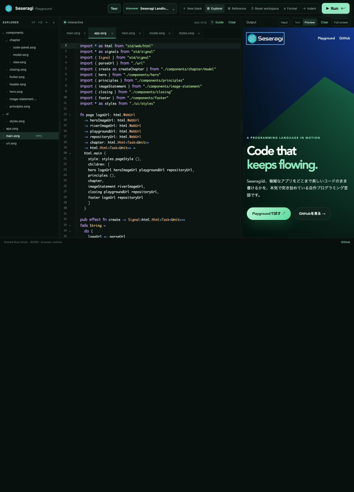
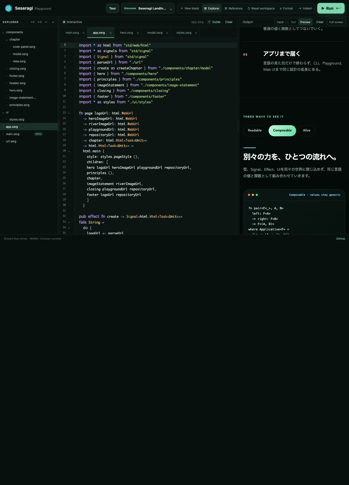
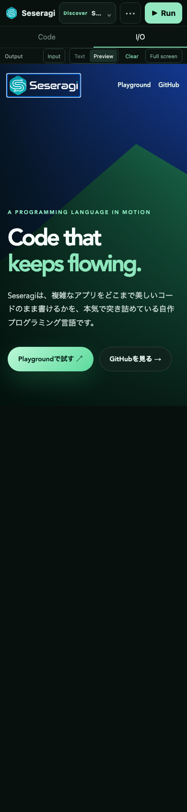
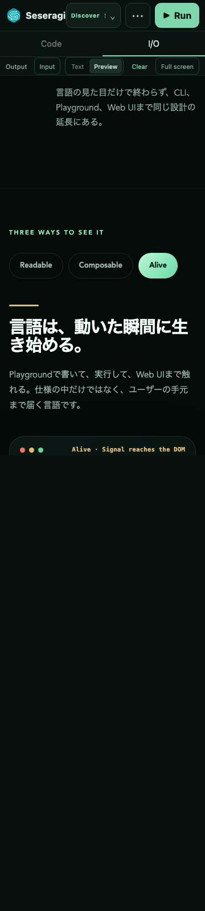
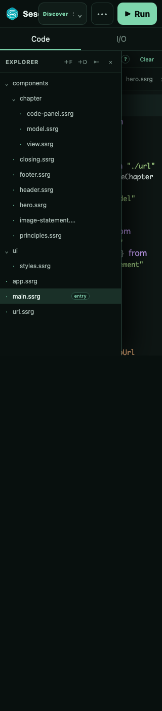

# Issue #244 Seseragi landing page Showcase review

Seseragi landing pageを、Playground Discoverから実行できるmulti-module
ShowcaseとしてChromiumで確認したreview artifactです。Issue添付のfull-page
screenshotとsource zipを実際に参照し、見た目だけでなくsectionとsource moduleの
対応まで確認しました。

## Design intent

- First view: forestとriverを想起させるdeep green、公式Seseragi logo、
  `Code that keeps flowing.`、優先順位の異なる二つのlinkで言語の世界観と次の行動を
  最初のviewportに収める。
- Layout rhythm: immersiveなhero、疎なprinciples、密度のあるinteractive code
  chapter、全幅image statement、余白の大きいclosingへsectionごとの密度を変える。
- Visual identity: mint accent、deep green、water / forest imageを一貫させ、既存
  Showcaseのpurple hero / white card構成を再利用しない。
- Interaction: Readable / Composable / Aliveのtabでheading、copy、accent、codeを
  同時に切り替え、pointerとkeyboardから同じ状態へ到達できる。
- Code structure: entry、application wiring、URL変換、visual sections、chapterの
  state / Action / view、shared styleを責務ごとのmoduleへ分離する。

## Recorded browser review

- runner: Playwright Chromium
- URL: `http://127.0.0.1:5173/`
- 記録日: 2026-08-11
- surfaces: Preview、desktop Explorer / tabs、mobile Code
- states: initial、Composable、Alive
- fixed external imageはdeterministicなlocal fixtureへrouteし、layoutを確認

| viewport / state | 確認内容 |
| --- | --- |
| desktop 1440 x 1000 / initial | first view、公式logo、link hierarchy、Explorerの13 module、Preview |
| desktop 1440 x 1000 / Composable | tab選択、heading / copy / codeの同時更新、contrast |
| iPhone 390 x 844 / initial | heroの一列flow、catch copy、link、横overflowなし |
| Android 360 x 800 / Alive | narrow flow、tab interaction、code panel、横overflowなし |
| minimum 320 x 800 / Code | Explorer、module tree、editor source、横overflowなし |

## Review result

desktopとmobileでpage hierarchyと固有のvisual identityを保ち、Composable / Aliveの
state切替でもlayout jumpとhorizontal overflowはありません。opaque fallback colorを
gradient付きprimary linkとselected tabへ加え、secondary linkもsolid backgroundへして、
実ブラウザのcomputed colorでcontrast contractを満たしました。

Explorerはpage構造を説明する13 moduleを表示し、`main.ssrg`はquery・Signal・
`dom.run`の実行境界、`app.ssrg`はcomposition、`components/chapter/`はstateと表示、
`ui/styles.ssrg`はshared named styleに限定されています。#242 / #243の修正済み
canonical identityをそのまま使い、Showcase固有の型変換や単一file化では回避していません。

この状態をIssue #244のhuman-approved baselineとして承認します。
