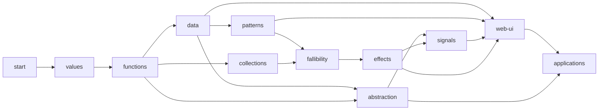

# Tour curriculum map

この文書は、A Tour of Seseragi を固定 3 chapter / 14 lesson から再設計するための
curriculum 正本です。#168 では学習順と依存関係を確定し、metadata と UI への実装は
#169 以降で行います。

lesson、chapter、category の総数は契約に含めません。言語 surface が増えたときは、
既存 lesson へ詰め込まず、安定 ID を持つ新しい学習単位を追加します。

## 設計原則

- 一つの lesson が新しく教える中心概念は原則一つとする。
- `goal` は教材の話題ではなく、修了後に学習者が書ける code で表す。
- `introduced` はその lesson で初めて説明する syntax、type、API、operator、
  runtime concept とする。
- `required` は source に現れるが、その lesson より前に説明済みでなければならない
  surface とする。
- `prerequisites` は直接の依存だけを持つ。推移的な依存を重複して列挙しない。
- beginner 向け canonical path はこの文書の lesson 掲載順とする。
- category から参照する場合も prerequisite は省略しない。未修了の prerequisite へ
  戻れる link を表示する。
- lesson 数、chapter 数、category 数、ID の数値幅を schema や UI の上限にしない。

## 現行 surface の棚卸し

棚卸しは `docs/spec/grammar.md`、`crates/seseragi-syntax/src/surface/`、
`crates/seseragi-semantics/src/prelude.rs`、`runtime/ts/src/`、
`examples/spec/COVERAGE.md`、`examples/samples/` の現行実装を根拠とした。
将来仕様だけに存在する surface は canonical path へ入れない。

| 領域 | 現行 Tour で扱える surface | 配置 |
|---|---|---|
| program | module、`pub`、`effect fn main`、`Unit`、`println` | `start` |
| literal と式 | String、Int、Float、Bool、Unit、template、型注釈、算術・比較・論理演算、`if`、block | `values` |
| 関数 | 宣言、application、curry、partial application、lambda、`$`、`|>`、local function、直接再帰 | `functions` |
| data | structural Record、Struct、tuple、spread、alias、Newtype | `data` |
| sum と pattern | ADT、constructor、`match`、tuple / record / constructor / collection pattern、網羅性 | `patterns` |
| collection | Array、List、Range、変換、絞り込み、集約、変換、comprehension | `collections` |
| 欠如と失敗 | Maybe、Either、`map`、`flatMap`、`do` | `fallibility` |
| Effect | 遅延計算、`effect fn`、`do`、`with`、`fails`、stdin、`Task<A>`、effectful `for` | `effects` |
| abstraction | generic function / data、Trait、instance、constraint、deriving、impl、custom operator | `abstraction` |
| Prelude | Semigroup、Monoid、Show、Debug、Functor、Applicative、Monad と 8 method、標準 instance | `abstraction` |
| Signal | `make`、`constant`、read `*`、write `:=`、map、combine、subscribe、transaction | `signals` |
| Web UI | `Html<Action>`、tag、Props、Style、SSR、Function component、typed event、form、`dom.app` | `web-ui` |
| project | import、namespace、visibility、複数 module、feature-owned state | `applications` |

現行 Prelude registry の学習対象は 7 traits
（Semigroup、Monoid、Show、Debug、Functor、Applicative、Monad）と、
8 methods（`append`、`empty`、`show`、`debug`、`map`、`pure`、`apply`、
`flatMap`）である。標準 instance は primitive と Array、List、Maybe、
Either、Range、Effect、Signal を含む。すべてを一 lesson へ列挙せず、具体型を先に
使った後で抽象を説明する。

## Taxonomy と category 導線

| 順 | Category | Chapter | 到達範囲 | 配送 Issue |
|---:|---|---|---|---:|
| 1 | `start` はじめの一歩 | 実行、最小 program | source を Run し、出力を読める | #172 |
| 2 | `values` 値と型 | literal、binding、式 | primitive な値と型を使える | #172 |
| 3 | `functions` 関数 | 定義と適用、値の流れ、scope | 小さな処理を関数へ分けられる | #173 |
| 4 | `data` データの形 | Record / tuple、Struct / Newtype | product type を組み立てられる | #174 |
| 5 | `patterns` 状態と分解 | ADT、pattern | 状態を型で表し安全に分岐できる | #174 |
| 6 | `collections` 複数の値 | Array / List / Range、変換と集約 | collection 処理を書ける | #175 |
| 7 | `fallibility` 欠如と失敗 | Maybe、Either | 欠如と失敗を値で扱える | #176 |
| 8 | `effects` Effect | 遅延、合成、environment / error | 副作用と失敗を型へ表せる | #177 |
| 9 | `abstraction` 再利用できる契約 | generic、Trait、instance、operator | 型を越えて再利用できる | #178 |
| 10 | `signals` 時間変化する値 | 生成、導出、更新 | reactive state を合成できる | #179 |
| 11 | `web-ui` browser UI | Html、component、event、form | typed interactive UI を作れる | #180 |
| 12 | `applications` 到達課題 | module、feature、統合課題 | 複数概念を project へまとめられる | #181 |

category 別の参照導線は、category の先頭 lesson と「前提を確認する」link を入口にする。
category 内の検索結果は canonical 順を変えず、lesson title、goal、introduced surface を
表示する。Recipe は課題別、Showcase は完成品別に Discover から探し、Tour の順序へ
混ぜない。

### Chapter map

chapter ID も表示順を含まない安定 ID とする。一つの chapter へ収める lesson 数は固定せず、
目的が二つに分かれた時点で chapter を追加する。

| Category | Chapter ID | 学習単位 | Lessons |
|---|---|---|---|
| `start` | `start-execution` | Playground、実行入口、標準 module | `start-run-source`〜`start-import-standard` |
| `values` | `values-literals` | primitive literal と式 | `values-let`〜`values-float` |
| `values` | `values-expression-results` | block、template、型、unary operator | `values-unit-block`〜`values-unary` |
| `functions` | `functions-definition-application` | 定義、application、curry、partial application | `functions-define`〜`functions-partial` |
| `functions` | `functions-composition` | lambda、`$`、`|>` | `functions-lambda`〜`functions-pipeline` |
| `functions` | `functions-scope-recursion` | local scope と直接再帰 | `functions-local`〜`functions-recursion` |
| `data` | `data-structural` | Record と tuple | `data-record-literal`〜`data-tuple` |
| `data` | `data-nominal` | Struct、alias、Newtype | `data-struct-declaration`〜`data-newtype` |
| `patterns` | `patterns-sum-types` | ADT と constructor | `patterns-adt`〜`patterns-payload` |
| `patterns` | `patterns-decomposition` | match、binding、網羅性 | `patterns-match`〜`patterns-let-block` |
| `collections` | `collections-kinds` | Array、List、Range | `collections-array`〜`collections-range` |
| `collections` | `collections-operations` | 変換、絞り込み、集約、変換 | `collections-map`〜`collections-convert` |
| `collections` | `collections-syntax` | comprehension と collection pattern | `collections-comprehension`〜`collections-patterns` |
| `fallibility` | `fallibility-maybe` | 欠如と安全な query | `fallibility-maybe`〜`fallibility-maybe-chain` |
| `fallibility` | `fallibility-either` | typed failure と fail-fast | `fallibility-either`〜`fallibility-either-chain` |
| `effects` | `effects-composition` | Effect value、do、contract | `effects-value`〜`effects-contract` |
| `effects` | `effects-boundaries` | stdin、Task、effectful traversal | `effects-stdin`〜`effects-for` |
| `abstraction` | `abstraction-generics` | generic function と data | `abstraction-generic-function`〜`abstraction-generic-data` |
| `abstraction` | `abstraction-traits` | Trait、instance、constraint、deriving | `abstraction-trait`〜`abstraction-show-debug` |
| `abstraction` | `abstraction-standard-traits` | Semigroup から Monad | `abstraction-semigroup-monoid`〜`abstraction-monad` |
| `abstraction` | `abstraction-nominal-behavior` | impl と custom operator | `abstraction-impl-method`〜`abstraction-operator` |
| `signals` | `signals-state` | 生成、読取、更新 | `signals-create-read`〜`signals-set-update` |
| `signals` | `signals-derivation` | derived value、購読、transaction | `signals-derived-map`〜`signals-transaction` |
| `web-ui` | `web-ui-pure-html` | Html、Props、component、SSR | `web-html-value`〜`web-ssr-preview` |
| `web-ui` | `web-ui-interaction` | Action、DOM、Signal render | `web-action-event`〜`web-signal-render` |
| `web-ui` | `web-ui-forms-features` | form、IME、feature state | `web-form-input`〜`web-feature-state` |
| `applications` | `applications-modules` | import、visibility、feature module | `applications-import`〜`applications-feature-module` |
| `applications` | `applications-capstones` | CLI、form、multi-feature 到達課題 | `applications-console-report`〜`applications-multi-feature` |

## Prerequisite graph

大きな流れは次の DAG とする。横線は「左を理解すれば右を開始できる」を表し、
category 内の詳細 edge は各 lesson 表を正本とする。



beginner 向け canonical path は次の順で全 lesson を通る。

```text
start → values → functions → data → patterns → collections
→ fallibility → effects → abstraction → signals → web-ui → applications
```

category 参照では DAG の必要部分だけを辿れる。たとえば collection API の参照者は
`collections-array` から開始できるが、lambda を使う `collections-map` では
`functions-lambda` が未修了なら先に案内する。

## Lesson map

表の `required` は直接利用する主要 surface だけを記す。`prerequisites` の
`required` は推移的に継承する。

### `start` — はじめの一歩と実行

| ID | Goal | Introduced | Required | Prerequisites |
|---|---|---|---|---|
| `start-run-source` | 用意された source を Run して Output を読める | Playground Code / Run / Output、source と出力の関係 | — | — |
| `start-main` | 最小の実行可能 program を書ける | module、`pub`、`effect fn`、`main`、`Unit` | Run | `start-run-source` |
| `start-print-string` | 一行の文字列を出力できる | String、string literal、`println`、単一引数 application | `main` | `start-main` |
| `start-import-standard` | 標準 module の公開関数を qualified name で呼べる | `import * as`、`std/` module specifier、namespace、qualified name | module、application | `start-print-string` |

### `values` — 値・literal・型

| ID | Goal | Introduced | Required | Prerequisites |
|---|---|---|---|---|
| `values-let` | 名前を付けた不変の値を再利用できる | `let`、immutable binding | String、`println` | `start-print-string` |
| `values-int` | Int を作り、四則演算の結果を出力できる | Int literal、Int、`+ - * / %` | `let` | `values-let` |
| `values-bool-if` | 条件から二つの値のどちらかを選べる | Bool、`true` / `false`、比較、`==` / `!=`、`if` expression | Int | `values-int` |
| `values-float` | Float を使い、Int と暗黙変換されないことを説明できる | Float literal、Float、明示的な数値型 | 算術式 | `values-int` |
| `values-unit-block` | block の最後の式と Unit を使い分けられる | `{ ... }` block、`()`、Unit value、式の結果 | `let` | `values-bool-if` |
| `values-template` | 値を含む String を組み立てられる | template String、`${...}` | String、Int | `values-int` |
| `values-annotation` | binding と式へ型注釈を書き、型違いを読める | type annotation、型推論との境界、基本 diagnostic | primitive types、`let` | `values-float`, `values-template` |
| `values-unary` | 数値の符号反転と Bool の否定を書ける | unary `-`、unary `!` | Int、Float、Bool | `values-bool-if`, `values-float` |

### `functions` — 関数定義・関数適用・値の流れ

| ID | Goal | Introduced | Required | Prerequisites |
|---|---|---|---|---|
| `functions-define` | 引数を一つ受け取り値を返す pure function を定義できる | `fn`、parameter、return type、pure function | type annotation | `values-annotation` |
| `functions-call` | 自分で定義した関数を呼び出せる | function application、function type | `fn` | `functions-define` |
| `functions-curry` | 複数 parameter の関数型を左から読める | currying、複数 parameter、right-associative arrow | application | `functions-call` |
| `functions-partial` | 一部の引数だけを渡して新しい関数を作れる | partial application | currying | `functions-curry` |
| `functions-lambda` | 小さな処理を匿名関数として渡せる | lambda、parameter annotation、closure | function type、application | `functions-call` |
| `functions-dollar` | 括弧を増やさず低優先順位で関数を適用できる | `$`、low-precedence application | application | `functions-call` |
| `functions-pipeline` | 値を複数の処理へ左から順に渡せる | `|>`、data-last function | application、partial application | `functions-partial` |
| `functions-local` | block 内の helper と capture を使える | local function、lexical scope、capture | block、`fn` | `values-unit-block`, `functions-define` |
| `functions-recursion` | 終了条件を持つ直接再帰を書ける | direct recursion、base case、tail position | `if`、local function | `functions-local` |

### `data` — Record・Struct・tuple・Newtype

| ID | Goal | Introduced | Required | Prerequisites |
|---|---|---|---|---|
| `data-record-literal` | 名前付き field を持つ structural Record を作れる | Record literal、structural record type | primitive values | `values-annotation` |
| `data-field-access` | Record の field を読み取れる | field access、width typing の利用側 | Record | `data-record-literal` |
| `data-record-spread` | 元の値を変更せず Record を更新できる | Record spread、immutable update | Record、field access | `data-field-access` |
| `data-tuple` | 位置で意味が決まる少数の値を tuple にまとめられる | tuple literal、tuple type、tuple access / pattern の入口 | primitive values | `values-annotation` |
| `data-struct-declaration` | domain 名を持つ Struct を宣言できる | `struct`、nominal type、constructor record | Record syntax | `data-record-literal` |
| `data-struct-values` | Struct を構築し field を読む関数を書ける | Struct construction、Struct field access | `struct`、function | `data-struct-declaration`, `functions-define` |
| `data-alias` | 長い型へ透明な別名を付けられる | `type` alias、transparent alias | type annotation | `values-annotation` |
| `data-newtype` | 同じ表現でも混同しない domain type を作れる | `newtype`、nominal wrapper、constructor による wrap、non-coercion | Struct construction | `data-struct-values` |

### `patterns` — ADT・constructor・pattern match

| ID | Goal | Introduced | Required | Prerequisites |
|---|---|---|---|---|
| `patterns-adt` | 取りうる状態を ADT と constructor で列挙できる | ADT declaration、nullary constructor | type declaration | `data-struct-declaration` |
| `patterns-payload` | constructor ごとに異なる payload を持たせられる | constructor payload、sum type | ADT、primitive / Struct | `patterns-adt`, `data-struct-values` |
| `patterns-match` | constructor に応じて値を返せる | `match` expression、constructor pattern | ADT、function | `patterns-payload`, `functions-define` |
| `patterns-binding` | pattern から payload、tuple、Record の値を束縛できる | pattern binding、tuple / Record / Struct / Newtype pattern | `match`、tuple、Record、Newtype | `patterns-match`, `data-tuple`, `data-field-access`, `data-newtype` |
| `patterns-exhaustive` | missing case の diagnostic を読み、網羅的に直せる | exhaustiveness、unreachable pattern diagnostic | `match` | `patterns-match` |
| `patterns-let-block` | irrefutable pattern を let と block で使える | pattern `let`、irrefutable pattern | binding、patterns | `patterns-binding`, `values-unit-block` |

### `collections` — Array・List・Range

| ID | Goal | Introduced | Required | Prerequisites |
|---|---|---|---|---|
| `collections-array` | 同じ型の値を Array literal に並べられる | Array、Array literal、element type | primitive values | `values-annotation` |
| `collections-list` | List literal と Array の用途の違いを説明できる | List、List literal、persistent list | Array | `collections-array` |
| `collections-range` | inclusive / exclusive な Int 範囲を作れる | Range、`..`、`..=`、境界 | Int | `values-int` |
| `collections-map` | collection の各要素を同じ規則で変換できる | `map` の具体利用、Functor の直感 | Array / List、lambda | `collections-array`, `collections-list`, `functions-lambda` |
| `collections-filter` | 条件に合う要素だけを残せる | `filter`、predicate | collection、Bool、lambda | `collections-map`, `values-bool-if` |
| `collections-fold` | 複数要素を一つの値へ集約できる | `reduce`、`sum`、`join`、accumulator | collection、function | `collections-filter`, `functions-curry` |
| `collections-convert` | Array、List、Range を目的の collection へ変換できる | `toArray`、`toList`、finite collection conversion | Array / List / Range | `collections-list`, `collections-range` |
| `collections-comprehension` | generator と guard から collection を作れる | collection comprehension、generator、guard | collection、pattern、Bool | `collections-convert`, `patterns-binding` |
| `collections-patterns` | empty / head / rest pattern で Array と List を分解できる | collection pattern、rest pattern | Array / List、recursion | `collections-list`, `patterns-binding`, `functions-recursion` |

### `fallibility` — Maybe・Either

| ID | Goal | Introduced | Required | Prerequisites |
|---|---|---|---|---|
| `fallibility-maybe` | 値がない可能性を Maybe として作り分けられる | type constructor application の読み方、`Maybe<A>`、`Nothing`、`Just` | ADT intuition | `patterns-match`, `collections-array` |
| `fallibility-maybe-match` | Maybe の二つの case から値を返せる | Maybe pattern match、default branch の考え方 | Maybe、`match` | `fallibility-maybe` |
| `fallibility-safe-query` | `get` / `find` の結果を安全に扱える | partial collection API、Maybe-returning lookup | collection、Maybe、predicate | `fallibility-maybe-match`, `collections-filter` |
| `fallibility-maybe-map` | Just の値だけを関数で変換できる | `map` on Maybe | Maybe、map、function | `fallibility-maybe-match`, `collections-map` |
| `fallibility-maybe-chain` | 値がない可能性を増やさず処理を連結できる | `flatMap` on Maybe、Maybe `do` | Maybe、function | `fallibility-maybe-map` |
| `fallibility-either` | success と typed failure を Either で表せる | `Either<E, A>`、`Left`、`Right` | ADT、type parameters の読み方 | `patterns-match`, `fallibility-maybe` |
| `fallibility-either-match` | Either の failure と success を表示し分けられる | Either pattern match、error value | Either、`match` | `fallibility-either` |
| `fallibility-either-chain` | 最初の failure で止まる処理を連結できる | `flatMap` / `do` on Either、fail-fast | Either、function | `fallibility-either-match`, `fallibility-maybe-chain` |

### `effects` — Effect・do・with・fails

| ID | Goal | Introduced | Required | Prerequisites |
|---|---|---|---|---|
| `effects-value` | Effect を「まだ実行していない計算」として説明できる | `Effect<R, E, A>`、deferred execution、pure / effect boundary | Either、function type | `fallibility-either` |
| `effects-do` | 複数 Effect を source 順に実行し結果を束縛できる | Effect `do`、`<-` bind、pure `let` in do | Effect、block | `effects-value`, `fallibility-either-chain` |
| `effects-contract` | 必要な environment と typed failure を関数型へ書ける | `effect fn` contract、`with`、`fails`、`Never` | Effect、type annotation | `effects-do` |
| `effects-stdin` | stdin の EOF / error を型に保って一行読める | `std/stdin`、service requirement、typed input failure | standard module、`with` / `fails`、Maybe / Either | `effects-contract`, `fallibility-maybe-match`, `start-import-standard` |
| `effects-task` | 失敗せず環境も不要な Effect を Task として読める | `Task<A>` alias、`Task<Unit>` | Effect contract、alias | `effects-contract`, `data-alias` |
| `effects-for` | collection を Effectful に source 順で処理できる | effectful `for`、effectful traversal、short-circuit | Effect、collection、lambda | `effects-do`, `collections-comprehension` |

### `abstraction` — generic・Trait・instance

| ID | Goal | Introduced | Required | Prerequisites |
|---|---|---|---|---|
| `abstraction-generic-function` | 型に依存しない関数を一度だけ定義できる | generic function、type parameter、parametricity | function type | `functions-curry`, `values-annotation` |
| `abstraction-generic-data` | payload の型を差し替えられる ADT / Struct を宣言できる | generic ADT、generic Struct、constructor inference | ADT、Struct、type parameter | `abstraction-generic-function`, `patterns-payload`, `data-struct-values` |
| `abstraction-trait` | 型が満たす振る舞いを Trait として宣言できる | `trait`、trait method、contract | generic types、function signature | `abstraction-generic-function` |
| `abstraction-instance` | concrete type に Trait の実装を与えられる | `instance`、dictionary、coherence | Trait、Struct / ADT | `abstraction-trait`, `data-struct-values` |
| `abstraction-constraint` | generic function が必要とする Trait を明記できる | `where` constraint、evidence selection | generic function、Trait / instance | `abstraction-instance` |
| `abstraction-show-debug` | primitive と自作型を canonical 表示できる | Show、Debug、`show`、`debug`、`deriving` | Trait / instance、ADT / Struct | `abstraction-instance`, `patterns-payload` |
| `abstraction-semigroup-monoid` | 結合と空値を generic に扱える | Semigroup、Monoid、`append`、`empty`、supertrait | constraint、String / Array / List | `abstraction-constraint`, `collections-list` |
| `abstraction-functor` | container の形を保って中身を変換できる | Functor、higher-kinded parameter、`<$>` | `map` concrete uses、constraint | `abstraction-constraint`, `fallibility-maybe-map`, `collections-map` |
| `abstraction-applicative` | container 内の関数と値を独立に組み合わせられる | Applicative、`pure`、`apply`、`<*>` | Functor、currying | `abstraction-functor`, `functions-curry` |
| `abstraction-monad` | 前の結果へ依存する計算を generic に連結できる | Monad、`flatMap`、`>>=`、do desugar | Applicative、Maybe / Either / Effect chain | `abstraction-applicative`, `fallibility-either-chain`, `effects-do` |
| `abstraction-impl-method` | nominal type に field 以外の操作を定義できる | `impl`、method、method call、visibility | Struct / Newtype、function | `data-newtype`, `abstraction-generic-function` |
| `abstraction-operator` | 自作型の二項 operator を宣言・実装できる | custom infix declaration、fixity、operator section、operator impl | Trait / instance、impl、function value | `abstraction-instance`, `abstraction-impl-method`, `functions-partial` |

### `signals` — Signal の生成・読取・変換・更新

| ID | Goal | Introduced | Required | Prerequisites |
|---|---|---|---|---|
| `signals-create-read` | MutableSignal を作り、現在値を Effect 内で読める | `std/signal`、`make`、MutableSignal、read `*` | standard module、Effect `do` | `effects-do`, `start-import-standard` |
| `signals-set-update` | state を明示的に置換・更新できる | write `:=`、update function、state mutation boundary | MutableSignal、lambda | `signals-create-read`, `functions-lambda` |
| `signals-derived-map` | 元の Signal を変更せず derived Signal を作れる | Signal、`signals.map`、dependency propagation | Signal、Functor intuition | `signals-set-update`, `abstraction-functor` |
| `signals-combine` | 複数 Signal から一つの値を導出できる | `combine`、Applicative Signal、`<*>` | derived Signal、curried function、Applicative | `signals-derived-map`, `abstraction-applicative` |
| `signals-subscribe` | 更新を購読し、lifetime を明示的に終了できる | `subscribe`、subscription、`unsubscribe`、lifetime | Signal、Effect | `signals-derived-map`, `effects-do` |
| `signals-transaction` | 複数更新を途中状態なしで一度に公開できる | `planSet`、`planUpdate`、`transaction`、atomic update | MutableSignal、Array、Effect | `signals-set-update`, `signals-combine`, `collections-array` |

### `web-ui` — Function component・event・form

| ID | Goal | Introduced | Required | Prerequisites |
|---|---|---|---|---|
| `web-html-value` | pure な Html value を一つ作れる | `std/web/html`、`Html<Action>`、text child | standard module、ADT type argument、String | `patterns-adt`, `data-record-literal`, `start-import-standard` |
| `web-tags-children` | tag と children から文書構造を作れる | element builder、`children`、IntoChildren、void element | Html、Record | `web-html-value`, `collections-array` |
| `web-props-style` | typed Props と Style で属性・見た目を指定できる | tag-specific Props、global / ARIA / data props、`html.style`、Style | Record、Html tags | `web-tags-children`, `data-record-spread` |
| `web-component` | Html を返す pure function component を定義できる | Function component、props as parameters、component composition | function、Html | `web-props-style`, `functions-curry` |
| `web-ssr-preview` | Html を String へ render し Preview で確認できる | `renderToString`、SSR、escaping、HTML Preview | Html component、pipeline | `web-component`, `functions-pipeline` |
| `web-action-event` | click を typed Action として reducer へ渡せる | event prop、typed Action、pure reducer | Html、ADT / match、function | `web-component`, `patterns-match` |
| `web-dom-app` | initial state、update、view を browser へ mount できる | `std/web/dom`、`dom.app`、target、mount / cleanup | typed Action、Effect、Struct state | `web-action-event`, `effects-contract`, `data-struct-values` |
| `web-signal-render` | Signal の変化から Html を再描画できる | Signal child / derived view、reconciliation の利用契約 | Signal、Html、component | `web-dom-app`, `signals-derived-map` |
| `web-form-input` | input と submit を typed event で処理できる | InputEvent、SubmitEvent、value snapshot、preventDefault | typed Action、form Props | `web-action-event`, `web-props-style` |
| `web-ime-accessibility` | IME 中の入力と keyboard / pointer、label / ARIA を安全に扱える | composition state、keyboard / pointer Action、accessible form contract | form event、Props | `web-form-input` |
| `web-feature-state` | component の state と event lifetime を feature 内に閉じられる | feature-owned MutableSignal、opaque action、cleanup boundary | Signal、DOM、module visibility | `web-signal-render`, `web-ime-accessibility`, `signals-subscribe` |

### `applications` — module と段階的な到達課題

| ID | Goal | Introduced | Required | Prerequisites |
|---|---|---|---|---|
| `applications-import` | 別 module の公開関数を import して使える | file-as-module、named / namespace import、module specifier | `pub`、function | `functions-call` |
| `applications-visibility` | 公開 API と private helper の境界を作れる | visibility、public interface、private symbol diagnostic | module、type / function declarations | `applications-import`, `data-struct-declaration` |
| `applications-feature-module` | model、view、entry を複数 file へ分割できる | module graph、feature boundary、public constructor function | visibility、Web component | `applications-visibility`, `web-feature-state` |
| `applications-console-report` | collection を読み、変換し、集計して report を出力できる | 到達課題: data report | functions、data、collections、Show | `collections-fold`, `abstraction-show-debug` |
| `applications-safe-input` | 入力の欠如・失敗を型に保った CLI flow を書ける | 到達課題: typed input flow | Maybe / Either、Effect、stdin | `effects-stdin`, `abstraction-show-debug` |
| `applications-reactive-form` | validation を含む一画面の typed form を作れる | 到達課題: reactive form | Signal、typed events、ADT reducer | `web-ime-accessibility`, `signals-transaction` |
| `applications-multi-feature` | 二つ以上の feature state を所有境界を保って合成できる | 到達課題: feature composition | multi-file module、feature-owned state | `applications-feature-module`, `applications-reactive-form` |

## 旧 14 lesson からの移行

旧 lesson は新 lesson の source をそのまま決めない。表は、どの概念をどこへ移すかを示す
移行 audit である。旧 lesson directory は新教材が実装されるまで fallback として保持し、
#172〜#180 で置換できた単位から retire する。

| 旧 lesson | 新 lesson |
|---|---|
| `01-hello-world` | `start-run-source`、`start-main`、`start-print-string` |
| `02-values-and-bindings` | `values-let`、`values-int`、`values-template`、`values-annotation` |
| `03-function-definitions` | `functions-define` |
| `04-function-calls` | `functions-call`、`functions-curry`、`functions-partial` |
| `05-pipelines` | `functions-dollar`、`functions-pipeline` |
| `06-records-and-structs` | `data-record-literal`〜`data-struct-values` |
| `07-adts-and-patterns` | `patterns-adt`〜`patterns-exhaustive` |
| `08-collections-and-ranges` | `collections-array`〜`collections-comprehension` |
| `09-maybe-and-either` | `fallibility-maybe`〜`fallibility-either-chain` |
| `10-effects-and-do` | `effects-value`〜`effects-task` |
| `11-generics-and-traits` | `abstraction-generic-function`〜`abstraction-operator` |
| `12-signals-and-state` | `signals-create-read`〜`signals-transaction` |
| `13-components-and-web-ui` | `web-html-value`〜`web-ssr-preview` |
| `14-integrated-app` | `web-action-event`〜`web-feature-state`、`applications-reactive-form` |

## Tour / Recipe / Showcase / Reference の境界

| Surface | 置き場所 | 判定 |
|---|---|---|
| 初めて出る syntax、type、operator、基本 API | Tour | prerequisite を持つ一概念の lesson にする |
| 既習概念の反復、小さな変更、よくある diagnostic | Tour lesson 内 | #170 の lesson format で扱う |
| Fibonacci、FizzBuzz、word count、目的別 collection 操作 | Recipe | 複数の既習概念を用途別に再利用する |
| completed form、feature composition、multi-file app | Showcase | 完成形を探索・実行する。導入説明は Tour へ戻す |
| API 全列挙、ABI、package、TypeScript interop、tooling option | Reference | 学習順ではなく検索性を優先する |

現行 `examples/samples/` の source は seed と実行根拠として再利用できるが、完成例を
lesson へコピーして新概念をまとめて導入しない。`project-greeting` は
`applications-import`、`project-flow-app` は `applications-multi-feature` の seed にできる。
`fizzbuzz`、`fibonacci-sequence`、`local-functions`、`newtypes`、
`unary-operators` は Recipe に残す。`form-todo`、`feature-composition`、
`html-components`、`interactive-app`、`signal-state` は Showcase を保ち、
Tour では縮小した一概念 source を新規に用意する。

## 現行 canonical path へ入れない surface

次は現行 compiler fixture や完成仕様に一部存在しても、Web UI application までの beginner
path では説明しない。実装済みで参照価値があるものは Reference / Recipe に置き、runtime
契約が未完了のものは教材 source に使用しない。

- Fiber、Deferred、Stream、resource scope、transformer、temporal control
- Bytes、Decimal、Regex、timezone、filesystem、JSON codec、BigInt
- Map / Set の完全 API、network / process / package registry
- TypeScript foreign block、`.d.ts` conversion、ABI と callback lifetime
- compiler / formatter / LSP / source map / benchmark の authoring surface
- hydration、portal、animation、router

## 後続 Issue への契約

### #169 data model

- category、chapter、lesson を配列として持ち、件数上限を schema に置かない。
- この文書の安定 ID、goal、introduced、required、prerequisites を lossless に表せる。
- order は表示用であり identity にしない。ID に二桁の連番 prefix を要求しない。
- prerequisite は直前 lesson 固定ではなく DAG の複数 edge を許す。
- canonical path と category 参照 path を同じ lesson object から導出する。

### #170 lesson format

- goal、prerequisites、完全な source、expected output / Preview、逐次説明、
  introduced surface、変更課題、実 diagnostic、振り返り、次 lesson を持つ。
- `required` が未導入なら生成または検証を失敗させる。
- source 内で教材用に未実装 surface を捏造しない。

### #171 navigation / progress

- global、category、chapter の progress を件数から導出する。
- long title を一行省略せず、desktop tree と mobile sheet の双方で現在地を示す。
- prerequisite 未完了 lesson は理由と戻り先を表示する。

### #172〜#181 lesson delivery

- この map の対応 category を実装単位にする。
- 一つの新 lesson で中心概念を増やしたくなった場合は lesson を追加する。
- seed sample は実装根拠であり、lesson の粒度を sample の大きさへ合わせない。

### #182 validation

- prerequisite graph の missing ID、self edge、cycle を検出する。
- canonical path 上で `required - previouslyIntroduced` が空であることを検証する。
- introduced surface の重複は、明示した再導入理由がない限り失敗させる。
- 全 lesson の compile、expected output / Preview、diagnostic fixture を検証する。
- category / chapter / lesson を大量追加した fixture で件数上限がないことを検証する。
